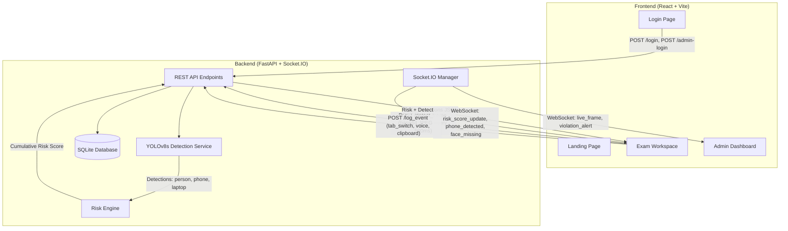
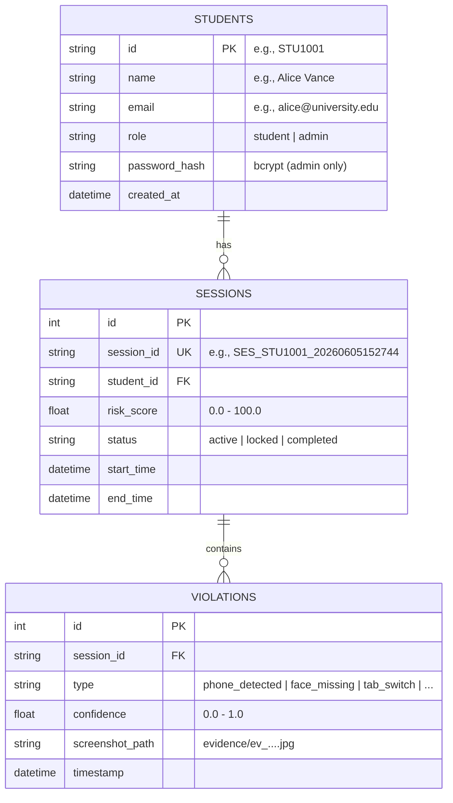

# ProctorAI — AI-Powered Real-Time Online Exam Proctoring Platform

## Project Overview

ProctorAI is a **full-stack AI-powered online exam proctoring system** that monitors students in real-time during online examinations using computer vision, audio analysis, and browser behavioral intelligence. Unlike traditional proctoring systems that stream raw video to external servers, ProctorAI processes frames **on the local server** using YOLOv8 object detection, ensuring faster response times and reduced bandwidth.

The platform provides two distinct interfaces:
- **Student Exam Workspace** — A secure, locked-down coding environment with real-time webcam monitoring
- **Admin Supervisor Dashboard** — A live monitoring console with real-time video feeds, violation alerts, risk analytics, and session management

---

## Architecture Overview



---

## Tech Stack

### Frontend

| Technology | Version | Purpose |
|---|---|---|
| **React** | 19.x | UI component framework |
| **Vite** | 6.x | Build tool & dev server with HMR |
| **React Router DOM** | 7.x | Client-side routing (Landing → Login → Exam / Admin) |
| **Socket.IO Client** | 4.x | Real-time bidirectional communication with backend |
| **Monaco Editor** | `@monaco-editor/react` | VS Code-grade code editor embedded in exam workspace |
| **Lucide React** | 0.511 | Premium SVG icon library (100+ icons used) |
| **Vanilla CSS** | — | Custom design system with CSS variables, glassmorphism, animations |
| **Google Fonts** | Outfit + JetBrains Mono | Typography (Outfit for UI, JetBrains Mono for code/terminal) |

### Backend

| Technology | Version | Purpose |
|---|---|---|
| **Python** | 3.10+ | Backend runtime |
| **FastAPI** | 0.115+ | High-performance async REST API framework |
| **Uvicorn** | 0.34+ | ASGI server for FastAPI |
| **SQLAlchemy** | 2.x | ORM for database operations |
| **SQLite** | Built-in | Lightweight relational database (file: `proctoring.db`) |
| **Ultralytics YOLOv8s** | 8.x | Real-time object detection (person, phone, laptop, remote) |
| **OpenCV** | `opencv-python-headless` | Image decoding (base64 → numpy array for YOLO) |
| **python-socketio** | 5.x | Real-time WebSocket event broadcasting |
| **PyJWT** | 2.x | JWT token generation and validation for authentication |
| **Passlib** + **bcrypt** | — | Password hashing for admin credentials |
| **Pydantic Settings** | 2.x | Configuration management with `.env` file support |

### AI / Computer Vision

| Component | Details |
|---|---|
| **Model** | YOLOv8s (Small variant, `yolov8s.pt` — 22.5 MB) |
| **Inference Size** | 416×416 pixels (optimized from default 640 for speed) |
| **Detected Classes** | `person` (COCO class 0), `cell phone` (67), `laptop` (63), `remote` (65) |
| **Person Threshold** | 0.35 confidence |
| **Device Threshold** | 0.30 confidence (lower for small/angled objects) |
| **Frame Rate** | 2 FPS (frame sent every 500ms) |

---

## How It Works — Complete Detection Pipeline

### Step 1: Student Authentication & Session Start

```
Student → Landing Page → Click "Student Login" → Enter Student ID + Name
→ POST /login → JWT token generated → Redirected to Exam Workspace
→ POST /start_exam → Session ID created (e.g., SES_STU1001_20260605152744)
→ Fullscreen mode activated → Webcam + Microphone access requested
```

- Students authenticate with just a **Student ID** and **Full Name** (no password required)
- Admins authenticate with **Username + Password + MFA (6-digit OTP)**
- JWT tokens are generated using **HS256** algorithm with 120-minute expiry

### Step 2: Real-Time Frame Capture (Frontend)

Every **500 milliseconds**, the frontend:

1. Captures the current webcam frame from the `<video>` element
2. Draws it onto a hidden `<canvas>` element (640×480)
3. Encodes it as a **JPEG base64 string** at 60% quality
4. Sends it to `POST /detect_frame` with the session ID and JWT auth header

```javascript
// Exam.jsx — Frame capture loop
const sendFrame = () => {
    context.drawImage(video, 0, 0, 640, 480);
    const base64Image = canvas.toDataURL("image/jpeg", 0.6);
    fetch(`${backendUrl}/detect_frame`, {
        method: "POST",
        body: JSON.stringify({ session_id, image_base64: base64Image })
    });
};
frameIntervalRef.current = setInterval(sendFrame, 500); // 2 FPS
```

### Step 3: YOLOv8s Object Detection (Backend)

The `YoloService` singleton:

1. **Decodes** the base64 string → OpenCV numpy array
2. **Runs YOLOv8s inference** at 416×416 resolution
3. **Filters results** to only relevant COCO classes (person, cell phone, laptop, remote)
4. **Applies confidence thresholds** — 0.35 for persons, 0.30 for devices
5. **Returns bounding boxes** as `[x1, y1, x2, y2]` with class name and confidence

```python
# yolo_service.py
results = self.model(img, imgsz=416, verbose=False)
for box in results[0].boxes:
    if cls_name in ["person", "cell phone", "laptop", "remote"]:
        if conf >= required_threshold:
            detections.append({"class_name": cls_name, "confidence": conf, "bbox": bbox})
```

### Step 4: Risk Engine Computation

The `RiskEngine` processes detections through a **temporal persistence system**:

#### Consecutive Frame Validation
Violations require multiple consecutive frames before triggering (prevents false positives):

| Violation | Required Consecutive Frames | Time to Trigger (at 2 FPS) |
|---|---|---|
| Phone/Laptop detected | **1 frame** | ~0.5 seconds |
| Face missing | **2 frames** | ~1 second |
| Multiple persons | **2 frames** | ~1 second |

#### Cumulative Risk Scoring
Risk is **cumulative and never decreases** during a session:

| Event | Risk Points | Cooldown |
|---|---|---|
| Phone detected | +10 | 30 seconds |
| Laptop detected | +10 | 30 seconds |
| Multiple persons | +8 | 30 seconds |
| Tab switch | +5 | 10 seconds |
| Fullscreen exit | +5 | 10 seconds |
| Voice detected | +5 | 10 seconds |
| Face missing | +3 | 15 seconds |
| Clipboard injection | +8 | 15 seconds |
| Copy/paste blocked | +2 | 5 seconds |

#### Behavior Score
`behavior_score = 100 - cumulative_risk_score`

When risk reaches **80%**, the exam is **auto-locked** and the student cannot type until the admin unlocks the session.

### Step 5: Real-Time Socket.IO Broadcasting

The backend emits events to both the student and admin dashboards simultaneously:

| Socket Event | Recipient | Payload |
|---|---|---|
| `risk_score_update` | Student + Admin | `{ session_id, risk_score, behavior_score, status }` |
| `phone_detected` | Student + Admin | `{ session_id, confidence, timestamp }` |
| `laptop_detected` | Student + Admin | Same |
| `face_missing` | Student + Admin | Same |
| `multiple_person_detected` | Student + Admin | Same |
| `violation_alert` | Admin only | `{ student_name, event_type, confidence, screenshot_path }` |
| `live_frame` | Admin only | `{ student_name, image_base64, detections, risk_score }` |
| `system_lock` | Student + Admin | `{ session_id, message }` |
| `system_unlock` | Student + Admin | `{ session_id }` |

### Step 6: Detection Overlay Rendering (Frontend)

When the backend returns detections, the frontend draws **bounding boxes** on a transparent canvas overlaying the webcam feed:

```javascript
// Draws colored boxes on the webcam overlay
detections.forEach((det) => {
    const color = det.class_name === "cell phone" ? "#ef4444" : "#8b5cf6";
    ctx.strokeRect(rectX, rectY, rectW, rectH); // Bounding box
    ctx.fillText(`${det.class_name.toUpperCase()} (${Math.round(det.confidence * 100)}%)`, ...);
});
```

### Step 7: Evidence Collection

When violations are confirmed, the backend:
1. **Saves a screenshot** (JPEG) to the `evidence/` directory
2. **Logs the violation** to the database with type, confidence, timestamp, and screenshot path
3. Evidence filenames follow the pattern: `ev_SES_STU1001_20260605152744_phone_detected_1717600064.jpg`

---

## Feature Breakdown

### 🎓 Student Exam Workspace

| Feature | Implementation |
|---|---|
| **Live Webcam Feed** | `<video>` element with mirrored display, hidden `<canvas>` for frame capture |
| **Detection Overlay** | Transparent `<canvas>` overlaying webcam with real-time bounding boxes |
| **Risk Gauge** | Circular SVG gauge with animated arc, color-coded (green → amber → red) |
| **Code Editor** | Monaco Editor (VS Code engine) with JavaScript syntax highlighting |
| **Test Runner** | Mock compiler that validates code against 3 predefined test cases |
| **Audio Monitoring** | Web Audio API `AnalyserNode` measures RMS dB level every 200ms, alerts above 68 dB |
| **Browser Lockdown** | Detects tab switches, fullscreen exits, copy/paste, right-click, keyboard shortcuts |
| **Toast Notifications** | Slide-in toast alerts for each violation type with auto-dismiss |
| **Event Timeline** | Chronological feed of all detected events with severity indicators |
| **Countdown Timer** | 30-minute exam timer with auto-submit on expiry |
| **Fullscreen Lock** | Automatically enters fullscreen; tracks exit attempts as violations |
| **Theme Toggle** | Dark/Light mode switcher persisted to localStorage |

### 🛡️ Admin Supervisor Dashboard

| Feature | Implementation |
|---|---|
| **Live Monitoring Grid** | Real-time cards for each active student showing webcam feed + risk score |
| **Live Video Streaming** | Admin receives base64 frames via Socket.IO, rendered in `` tags |
| **Violation Alert Feed** | Real-time scrolling timeline of all violations across all students |
| **Risk Analytics** | Per-student risk breakdown with confidence charts |
| **Session Unlock** | Admin can manually unlock locked student sessions via API |
| **Search & Filter** | Search students by name/ID, filter by risk level |
| **Completed Exams Table** | Sortable, filterable, paginated table of past exam sessions |
| **Calibration Controls** | Adjustable lock threshold slider and audio limit slider |
| **Collapsible Sidebar** | Navigation sidebar with collapse/expand toggle |
| **Skeleton Loaders** | Shimmer loading placeholders while data loads |

### 🏠 Landing Page

| Feature | Implementation |
|---|---|
| **Hero Section** | Gradient text headline, product description, dual CTA buttons |
| **Floating AI Cards** | 7 animated glassmorphism cards showing detection states (face, phone, risk score, etc.) |
| **Features Grid** | 6 cards: Face Tracking, Device Detection, Multi-Face, Gaze Analysis, Audio, Browser Lock |
| **How It Works** | 4-step numbered workflow (Authenticate → Verify → Monitor → Audit) |
| **Footer** | 3-column layout with logo, nav links, developer info |
| **Theme Toggle** | Dark/Light mode toggle in navigation bar |

### 🔐 Authentication System

| Feature | Implementation |
|---|---|
| **Student Login** | Student ID + Full Name → auto-creates account if new, JWT token issued |
| **Admin Login** | Username + Password + 6-digit MFA OTP → verified against bcrypt hash |
| **Role-based Routing** | `LoginGuard` component clears stale sessions when switching roles |
| **JWT Tokens** | HS256 algorithm, 120-minute expiry, stored in localStorage |
| **Session Persistence** | User session persisted to localStorage, auto-restored on page refresh |

---

## Database Schema



---

## API Endpoints

| Method | Endpoint | Auth | Description |
|---|---|---|---|
| `POST` | `/login` | None | Student login (auto-register) |
| `POST` | `/admin-login` | None | Admin login with password verification |
| `POST` | `/start_exam` | JWT | Creates new exam session |
| `POST` | `/detect_frame` | JWT | Sends webcam frame for YOLO + risk analysis |
| `POST` | `/log_event` | JWT | Logs browser/audio telemetry events |
| `POST` | `/execute_code` | JWT | Mock code compiler with test cases |
| `POST` | `/end_exam` | JWT | Ends exam session |
| `GET` | `/risk_score/{session_id}` | JWT | Fetches current risk score |
| `GET` | `/violations/{session_id}` | JWT | Lists all violations for a session |
| `GET` | `/admin/dashboard` | Admin JWT | Full dashboard data (stats + sessions + violations) |
| `POST` | `/admin/unlock-session` | Admin JWT | Unlocks a locked student session |
| `GET` | `/evidence/{filename}` | Static | Serves evidence screenshot images |

---

## Project File Structure

```
d:\AI Exam\
├── backend\
│   ├── app\
│   │   ├── __init__.py
│   │   ├── main.py              # FastAPI app, all API routes
│   │   ├── yolo_service.py      # YOLOv8s singleton detection service
│   │   ├── risk_engine.py       # Cumulative risk scoring engine
│   │   ├── socket_manager.py    # Socket.IO event broadcasting
│   │   ├── models.py            # SQLAlchemy ORM models
│   │   ├── database.py          # SQLite database engine setup
│   │   ├── auth.py              # JWT + bcrypt authentication
│   │   ├── config.py            # Pydantic settings (.env support)
│   │   ├── schemas.py           # Pydantic request/response schemas
│   │   └── crud.py              # Database CRUD operations
│   ├── evidence\                # Auto-saved violation screenshots
│   ├── yolov8s.pt               # Pre-trained YOLOv8s model weights
│   ├── proctoring.db            # SQLite database file
│   ├── requirements.txt         # Python dependencies
│   └── venv\                    # Python virtual environment
│
├── frontend\
│   ├── src\
│   │   ├── pages\
│   │   │   ├── Landing.jsx      # SaaS-style landing page
│   │   │   ├── Login.jsx        # Student + Admin login with MFA
│   │   │   ├── Exam.jsx         # Student exam workspace (webcam + editor)
│   │   │   └── AdminDashboard.jsx # Admin monitoring console
│   │   ├── components\
│   │   │   ├── Modal.jsx        # Custom confirm/alert dialogs
│   │   │   ├── RiskGauge.jsx    # Circular SVG risk gauge
│   │   │   ├── StudentGridCard.jsx # Live student monitoring card
│   │   │   ├── AlertTimeline.jsx   # Violation event timeline
│   │   │   └── ConfidenceChart.jsx # Detection confidence chart
│   │   ├── hooks\
│   │   │   └── useBrowserSecurity.jsx # Browser lockdown hook
│   │   ├── App.jsx              # Root routing + auth guard
│   │   ├── App.css              # App-level styles
│   │   ├── index.css            # Full design system (1500+ lines)
│   │   └── main.jsx             # React entry point
│   ├── index.html               # HTML entry
│   ├── package.json             # npm dependencies
│   └── vite.config.js           # Vite configuration
```

---

## Design System

The entire application uses a **unified CSS design system** with:

- **CSS Variables** for all colors, shadows, and spacing — enabling instant dark/light theme switching
- **Glassmorphism** cards with `backdrop-filter: blur()` and translucent backgrounds
- **Indigo (#7c3aed)** as the primary accent color throughout
- **Outfit** font for UI text, **JetBrains Mono** for code and terminal output
- **Consistent 16px border-radius** on all cards, **12px** on badges/icons
- **Hover micro-animations** with `cubic-bezier(0.16, 1, 0.3, 1)` easing
- **Floating animations** (`animate-float-slow/medium/fast`) for the landing page hero cards
- **Custom scrollbars**, **range sliders**, and **floating label inputs**
- **Toast notification system** with slide-in animations and auto-dismiss

---

## Running the Application

### Backend
```bash
cd backend
python -m venv venv
venv\Scripts\activate          # Windows
pip install -r requirements.txt
uvicorn app.main:app --host 127.0.0.1 --port 8000
```

### Frontend
```bash
cd frontend
npm install
npm run dev                    # Starts on http://localhost:5173
```

### Default Credentials
| Role | Username | Password |
|---|---|---|
| Admin | `admin` | `admin123` |
| Student | Any ID (e.g., `STU1001`) | — (name only) |

---

## Key Technical Decisions

| Decision | Rationale |
|---|---|
| **YOLOv8s** (not v8n or v8m) | Best balance of accuracy and speed for single-user real-time inference |
| **416px inference size** | ~2× faster than default 640px while maintaining acceptable detection quality |
| **2 FPS frame rate** | Sufficient for proctoring; reduces server load vs higher rates |
| **Cumulative non-decreasing risk** | Prevents students from "resetting" their score by stopping violations temporarily |
| **SQLite** (not PostgreSQL) | Zero-config local development; easily swappable via `DATABASE_URL` env var |
| **Socket.IO** (not raw WebSocket) | Built-in rooms, reconnection, fallback polling — ideal for admin broadcast |
| **Base64 frame transfer** | Simplifies the pipeline (no multipart upload) at the cost of ~33% larger payloads |
| **On-server inference** (not edge) | Model runs on the backend server, not in the browser — ensures consistent performance |

---

> **Developed by:** Kesavan S | skesavan124@gmail.com
> **© 2026** ProctorAI — AI Exam Proctoring Platform. All Rights Reserved.
